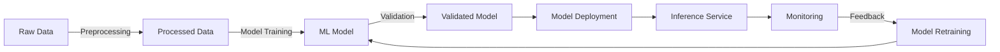
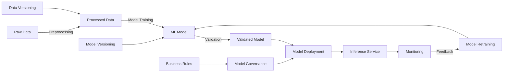

---
tags:
  - Mlops
  - Introduction
---

# Intro to MLops

MLOps, or Machine Learning Operations, is a discipline that merges the # MLOps:
 Unifying Machine Learning System Development and Operation

MLOps, or Machine Learning Operations, is a discipline that merges the
 development (Dev) and operation (Ops) of machine learning (ML) systems. As
  data science and ML continue to become key capabilities for solving complex
   real-world problems, the practice of MLOps is gaining traction. MLOps aims
    to promote automation and monitoring throughout the construction of ML
     systems, including integration, testing, release, deployment, and
      infrastructure management.

## MLOps is More than Just ML Code

The complexity of real-world ML systems goes beyond the ML code. The required
 elements surrounding the ML code comprise a vast and intricate system that
  includes configuration, automation, data collection, data verification,
   testing and debugging, resource management, model analysis, process and
    metadata management, serving infrastructure, and monitoring. In other words,
    only a small fraction of an ML system is composed of the ML code
     itself.

## MLOps: A Marriage of DevOps and Machine Learning

Just as DevOps principles have proved beneficial in the development and
 operation of large-scale software systems, these principles are applicable to
  ML systems as well. However, ML systems have distinct characteristics:

1.  **Team skills**: An ML project typically involves data scientists or ML
    researchers who might not be experienced software engineers capable of
     building production-class services.
2.  **Development**: ML is experimental in nature. Challenges arise in tracking
    what worked and what didn't, and maintaining reproducibility while
     maximizing code reusability.
3.  **Testing**: Testing an ML system is more complex than testing other
   software systems. It requires data validation, trained model quality
    evaluation, and model validation.
4.  **Deployment**: Deployment in ML systems often entails deploying a
    multi-step pipeline to automatically retrain and deploy models.
5.  **Production**: ML models can experience performance degradation due to
    constantly evolving data profiles, necessitating the tracking of summary
     statistics of data and monitoring of the online performance of models.

## Developing ML Models: Steps to Success

Although the precise steps may vary depending on the specific ML project, a
 general process can be outlined for developing ML models:

1.  **Understanding the problem**: This involves defining the business problem,
    identifying the ML task, and preparing the initial data.
2.  **Data preparation**: This step includes gathering, cleaning, and
    transforming data for the ML model.
3.  **Model building**: This includes selecting the model, training it, and then
    evaluating its performance.
4.  **Model deployment**: This involves deploying the model into a production environment.
5.  **Monitoring and maintenance**: This step involves monitoring the
    performance of the model over time, retraining it as necessary, and
     performing model updates.

## MLOps Maturity Levels

MLOps maturity levels can be described in three stages:

###  MLOps level 0: Manual process

### MLOps level 1: ML pipeline automation

### Mlops level 2: ML pipeline automation

Many teams have data scientists and ML researchers who can build
 state-of-the-art models, but their process for building and deploying ML
  models is entirely manual. This is considered the basic level of maturity, or
   level 0. The following diagram shows the workflow of this process.

1.  **Level 1: Manual**: Processes at this level are largely manual, with models
    being trained on local machines and predictions made in batch mode.
2.  **Level 2: Automated**: This level involves automating training and serving
    pipelines. However, these processes are still treated as separate entities.
3.  **Level 3: Continuous Integration, Continuous Deployment, and Continuous
    Training (CI/CD/CT)**: At this level, all processes are fully automated and
      integrated. Continuous training is used to ensure the model is retrained
      on new data, and updated models are automatically deployed.

##  Basic MLOps architecture

In this basic setup, raw data is processed and used to train a machine learning model.
The model is then deployed as an inference service, which is monitored to ensure
it's working correctly.

## Intermediate MLOps architecture

In an intermediate setup, the model is validated before deployment. There's
 also a feedback loop from monitoring to model retraining, allowing the model
  to be improved
over time based on its performance in the real world.

##  Advanced MLOps architecture

In an advanced setup, there are additional components for model governance (which
applies business rules to the models), data versioning (which keeps track of changes
to the data over time), and model versioning (which keeps track of changes to the
models over time).

Remember, these are simplified examples and actual MLOps architectures can be much
more complex. They can also vary widely depending on the specific needs and
constraints of the organization, the project, and the data.

#  References

* [Google Mlops levels](https://cloud.google.com/architecture/mlops-continuous-delivery-and-automation-pipelines-in-machine-learning)
